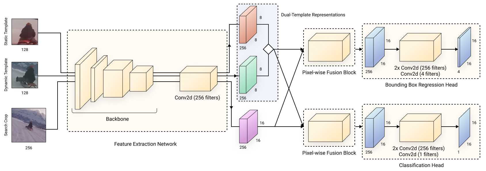

<div align="center">

# FEAR: Fast, Efficient, Accurate and Robust Visual Tracker
[](https://arxiv.org/abs/2112.07957)
[](https://www.ecva.net/papers/eccv_2022/papers_ECCV/papers/136820625.pdf)

</div>



This is an official repository for the paper
```
FEAR: Fast, Efficient, Accurate and Robust Visual Tracker
Vasyl Borsuk, Roman Vei, Orest Kupyn, Tetiana Martyniuk, Igor Krashenyi, Jiři Matas
ECCV 2022
```

## Environment setup
The training code is tested on Linux systems and mobile benchmarking on MacOS systems.
```shell
conda create -n py37fear python=3.7
conda activate py37fear
pip install -r requirements.txt
```
**N.B.** You might need to remove `xtcocotools` requirement when installing environment on MacOS system for model evaluation.

## Demo inference with Python
The FEAR-XS model checkpoint is available in the `evaluate/checkpoints` folder. To run the inference code:
```shell
PYTHONPATH=. python demo_video.py --initial_bbox=[163,53,45,174] \
--video_path=assets/test.mp4 \
--output_path=outputs/test.mp4
```
**N.B.** This FEAR-XS model is releeased without the Dynamic Template Update.

## FEAR Benchmark
We provide FEAR evaluation protocol implementation in `evaluate/MeasurePerformance` directory. 
You should do the following steps on MacOS device to evaluate model on iOS device:
1. Open `evaluate/MeasurePerformance` project in Xcode. 
You can do this by double-clicking on `evaluate/MeasurePerformance/MeasurePerformance.xcodeproj` file or by opening it from the Open option in Xcode. 
2. Connect iOS device to your computer and build the project into it. 
3. Select one of the benchmark options by tapping on the corresponding button on your mobile device:
   - _Benchmark FPS_: launches simple model benchmark that warms up the model for 20 iterations and measures average FPS across 100 model calls. The result is displayed in Xcode console.
   - _Benchmark Online_: launches FEAR online benchmark as described in the paper
   - _Benchmark Offline_: launches FEAR offline benchmark

Do the following steps on MacOS device to convert model into CoreML:
1. To convert the model trained in PyTorch to CoreML with the following command from the project root directory.
This command will produce a file with the model in CoreML format (`Model.mlmodel`) and a model with FP16 weight quantization (`Model_quantized.mlmodel`).
 ```shell
 PYTHONPATH=. python evaluate/coreml_convert.py
 ```
2. Move converted model into the iOS project with the following command `cp Model_quantized.mlmodel evaluate/MeasurePerformance/MeasurePerformance/models/Model_quantized.mlmodel`.

### Count FLOPS and parameters
```shell
PYTHONPATH=. python evaluate/macs_params.py
```

## Demo app for iOS

[Demo app screen recording](https://user-images.githubusercontent.com/24678253/179550055-689ee927-ff22-4c19-8087-539623cb1c2c.mp4)

1. Open `evaluate/FEARDemo` project in Xcode.
2. Connect iOS device to your computer and build the project. 
Make sure to enable developer mode on your iOS device and trust your current apple developer.
Also, you will need to select a development team under the signing & capabilities pane of the project editor (navigation described here [here](https://developer.apple.com/documentation/xcode/adding-capabilities-to-your-app))

**N.B.** The demo app does not contain bounding box smoothing postprocessing steps of the tracker so its output is slightly different from Python.

## Training
### Data preparation
There are two dataset configurations. 
Download all datasets from the configuration file you'll train with and put them into the directory specified in `visual_object_tracking_datasets` configuration field.
You can change the value of `visual_object_tracking_datasets` to your local dataset path.
There are two dataset configurations:
1. Quick train on GOT-10k dataset <br />
   Config file: `model_training/config/dataset/got10k_train.yaml`
2. Full train on LaSOT, COCO2017, YouTube-BoundingBoxes, GOT-10k and ILSVRC <br />
   Config file: `model_training/config/dataset/full_train.yaml`

You should create CSV annotation file for each of training datasets.
We don't provide CSV annotations as some datasets have license restrictions.
The annotation file for each dataset should have the following format:
- `sequence_id: str` - unique identifier of video file
- `track_id: str` - unique identifier of scene inside video file
- `frame_index: int` - index of frame inside video
- `img_path: str` - location of frame image relative to root folder with all datasets
- `bbox: Tuple[int, int, int, int]` - bounding box of object in a format `x, y, w, h`
- `frame_shape: Tuple[int, int]` - width and height of image
- `dataset: str` - label to identify dataset (example: `got10k`)
- `presence: int` - presence of the object (example, `0/1`)
- `near_corner: int` - is bounding box touches borders of the image (example, `0/1`)

### Run training
Current training code supports model training without Dynamic Template Update module, it'll be added soon.
You can launch training with default configuration with the following command from the project root directory:
```shell
PYTHONPATH=. python model_training/train.py backend=2gpu
# or the following for full train
PYTHONPATH=. python model_training/train.py dataset=full_train backend=2gpu
```

## Citation

If you use the FEAR Tracker benchmark, demo, models or code for your research projects, please cite the following paper:

```
@inproceedings{borsuk2022fear,
  title={FEAR: Fast, efficient, accurate and robust visual tracker},
  author={Borsuk, Vasyl and Vei, Roman and Kupyn, Orest and Martyniuk, Tetiana and Krashenyi, Igor and Matas, Ji{\v{r}}i},
  booktitle={European Conference on Computer Vision},
  pages={644--663},
  year={2022},
  organization={Springer}
}
```
