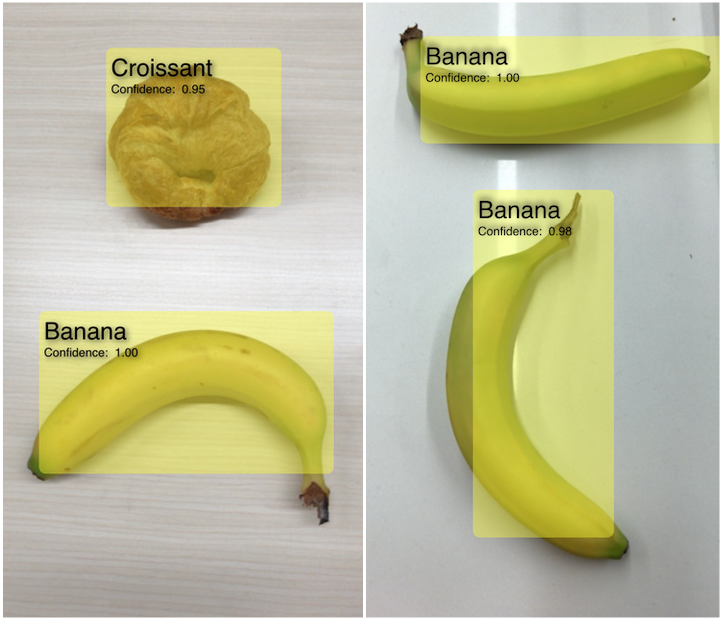

# Recognizing Objects in Live Capture

Apply Vision algorithms to identify objects in real-time video.

## Overview

With the [Vision](https://developer.apple.com/documentation/vision) framework, you can recognize objects in live capture.  Starting in iOS 12, macOS 10.14, and tvOS 12, Vision requests made with a Core ML model return results as  [`VNRecognizedObjectObservation`](https://developer.apple.com/documentation/vision/vnrecognizedobjectobservation) objects, which identify objects found in the captured scene.

This sample app shows you how to set up your camera for live capture, incorporate a Core ML model into Vision, and parse results as classified objects.



## Set Up Live Capture

Although implementing AV live capture is similar from one capture app to another, configuring the camera to work best with Vision algorithms involves some subtle differences.

**Configure the camera to use for capture.**  This sample app feeds camera output from AVFoundation into the main view controller.  Start by configuring an  [`AVCaptureSession`](https://developer.apple.com/documentation/avfoundation/avcapturesession):

``` swift
private let session = AVCaptureSession()
```

**Set your device and session resolution.** It’s important to choose the right resolution for your app.  Don’t simply select the highest resolution available if your app doesn’t require it.  It’s better to select a lower resolution so Vision can process results more efficiently.  Check the model parameters in Xcode to find out if your app requires a resolution smaller than 640 x 480 pixels.

Set the camera resolution to the nearest resolution that is greater than or equal to the resolution of images used in the model:

``` swift
let videoDevice = AVCaptureDevice.DiscoverySession(deviceTypes: [.builtInWideAngleCamera], mediaType: .video, position: .back).devices.first
do {
    deviceInput = try AVCaptureDeviceInput(device: videoDevice!)
} catch {
    print("Could not create video device input: \(error)")
    return
}

session.beginConfiguration()
session.sessionPreset = .vga640x480 // Model image size is smaller.
```

Vision will perform the remaining scaling.

**Add video input to your session by adding the camera as a device:**

``` swift
guard session.canAddInput(deviceInput) else {
    print("Could not add video device input to the session")
    session.commitConfiguration()
    return
}
session.addInput(deviceInput)
```

**Add video output to your session, being sure to specify the pixel format:**

``` swift
if session.canAddOutput(videoDataOutput) {
    session.addOutput(videoDataOutput)
    // Add a video data output
    videoDataOutput.alwaysDiscardsLateVideoFrames = true
    videoDataOutput.videoSettings = [kCVPixelBufferPixelFormatTypeKey as String: Int(kCVPixelFormatType_420YpCbCr8BiPlanarFullRange)]
    videoDataOutput.setSampleBufferDelegate(self, queue: videoDataOutputQueue)
} else {
    print("Could not add video data output to the session")
    session.commitConfiguration()
    return
}
```

**Process every frame, but don’t hold on to more than one Vision request at a time.**  The camera will stop working if the buffer queue overflows available memory.  To simplify buffer management, in the capture output, Vision blocks the call for as long as the previous request requires.  As a result, AVFoundation may drop frames, if necessary.  The sample app keeps a queue size of 1; if a Vision request is already queued up for processing when another becomes available, skip it instead of holding on to extras.  

``` swift
let captureConnection = videoDataOutput.connection(with: .video)
// Always process the frames
captureConnection?.isEnabled = true
do {
    try  videoDevice!.lockForConfiguration()
    let dimensions = CMVideoFormatDescriptionGetDimensions((videoDevice?.activeFormat.formatDescription)!)
    bufferSize.width = CGFloat(dimensions.width)
    bufferSize.height = CGFloat(dimensions.height)
    videoDevice!.unlockForConfiguration()
} catch {
    print(error)
}
```

**Commit the session configuration:**

``` swift
session.commitConfiguration()
```

Set up a preview layer on your view controller, so the camera can feed its frames into your app’s UI:

``` swift
previewLayer = AVCaptureVideoPreviewLayer(session: session)
previewLayer.videoGravity = AVLayerVideoGravity.resizeAspectFill
rootLayer = previewView.layer
previewLayer.frame = rootLayer.bounds
rootLayer.addSublayer(previewLayer)
```

## Specify Device Orientation

You must input the camera’s orientation properly using the device orientation.  Vision algorithms aren’t orientation-agnostic, so when you make a request, use an orientation that's relative to that of the capture device.

``` swift
let curDeviceOrientation = UIDevice.current.orientation
let exifOrientation: CGImagePropertyOrientation

switch curDeviceOrientation {
case UIDeviceOrientation.portraitUpsideDown:  // Device oriented vertically, home button on the top
    exifOrientation = .left
case UIDeviceOrientation.landscapeLeft:       // Device oriented horizontally, home button on the right
    exifOrientation = .upMirrored
case UIDeviceOrientation.landscapeRight:      // Device oriented horizontally, home button on the left
    exifOrientation = .down
case UIDeviceOrientation.portrait:            // Device oriented vertically, home button on the bottom
    exifOrientation = .up
default:
    exifOrientation = .up
}
```

## Designate Labels Using a Core ML Classifier

The Core ML model you include in your app determines which labels are used in Vision’s object identifiers.  The model in this sample app was trained in Turi Create 4.3.2 using Darknet YOLO (You Only Look Once). See [Object Detection](https://apple.github.io/turicreate/docs/userguide/object_detection/) to learn how to generate your own models using Turi Create. Vision analyzes these models and returns observations as [`VNRecognizedObjectObservation`](https://developer.apple.com/documentation/vision/vnrecognizedobjectobservation) objects.

Load the model using a [`VNCoreMLModel`](https://developer.apple.com/documentation/vision/vncoremlmodel):

``` swift
let visionModel = try VNCoreMLModel(for: MLModel(contentsOf: modelURL))
```

Create a [`VNCoreMLRequest`](https://developer.apple.com/documentation/vision/vncoremlrequest) with that model:

``` swift
let objectRecognition = VNCoreMLRequest(model: visionModel, completionHandler: { (request, error) in
    DispatchQueue.main.async(execute: {
        // perform all the UI updates on the main queue
        if let results = request.results {
            self.drawVisionRequestResults(results)
        }
    })
})
```

The completion handler could execute on a background queue, so perform UI updates on the main queue to provide immediate visual feedback.

Access results in the request’s completion handler, or through the `requests` property.

## Parse Recognized Object Observations

The `results` property is an array of observations, each with a set of labels and bounding boxes. Parse those observations by iterating through the array, as follows:

``` swift
for observation in results where observation is VNRecognizedObjectObservation {
    guard let objectObservation = observation as? VNRecognizedObjectObservation else {
        continue
    }
    // Select only the label with the highest confidence.
    let topLabelObservation = objectObservation.labels[0]
    let objectBounds = VNImageRectForNormalizedRect(objectObservation.boundingBox, Int(bufferSize.width), Int(bufferSize.height))
    
    let shapeLayer = self.createRoundedRectLayerWithBounds(objectBounds)
    
    let textLayer = self.createTextSubLayerInBounds(objectBounds,
                                                    identifier: topLabelObservation.identifier,
                                                    confidence: topLabelObservation.confidence)
    shapeLayer.addSublayer(textLayer)
    detectionOverlay.addSublayer(shapeLayer)
}
```

The `labels` array lists each classification `identifier` along with its `confidence` value, ordered from highest confidence to lowest.  The sample app notes only the classification with the highest `confidence` score, at element `0`.  It then displays this classification and confidence in a textual overlay.

The bounding box tells where the object was observed. The sample uses this location to draw a bounding box around the object.

This sample simplifies classification by returning only the top classification; the array is ordered in decreasing order of confidence score.  However, your app could analyze the confidence score and show multiple classifications, either to further describe your detected objects, or to show competing classifications.

You can also use the [`VNRecognizedObjectObservation`](https://developer.apple.com/documentation/vision/vnrecognizedobjectobservation) resulting from object recognition to initialize an object tracker such as [`VNTrackObjectRequest`](https://developer.apple.com/documentation/vision/vntrackobjectrequest).  For more information about tracking, see the article on object tracking: [`Tracking Multiple Objects or Rectangles in Video`](https://developer.apple.com/documentation/vision/tracking_multiple_objects_or_rectangles_in_video).
